# Introduction

Over the financial year of 2013-2104, investors seeks to know how well the manufacturers in the Stationery Industry are fairing to help guide thier decision on which of the investor should they invest through and if thier investment will worth it.

# Problem Statement

1. Calculate the following, using either Excel or DAX functions:
a. Gross Sales
b. Discount (use the discount rate)
c. Revenue
d. Profit before Tax
e. Profit Margin
f. Tax on Profit (tax rate 5%)
g. Profit after Tax
2. Create a report overview for:
a. Segment
b. State
c. Product
3. Produce a report on all products sold between January and December 2014, showing number of sales, sales proportions and financial performance. Ensure your analysis can be used to determine whether there is growth or decline on any of the product lines.
4. What key products are the drivers of performance?
5. If we would like to discontinue any product sub due to poor outcomes, what would this be?
6. What product do we pay the highest tax on?

# Skills I demonstrated

Dax formula, Measures, Data visualization, story telling.

# Data set

The dataset can is Excel file named Ofice Supply

# Visuals

The report consist of 

Overview page
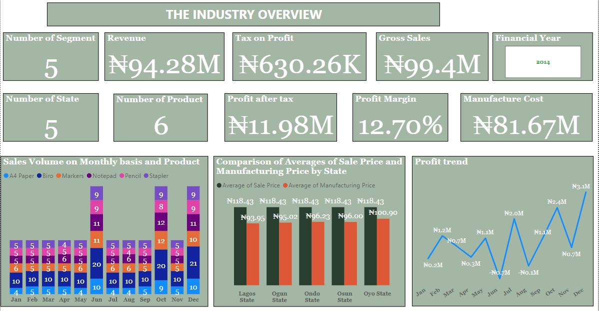

Segment page
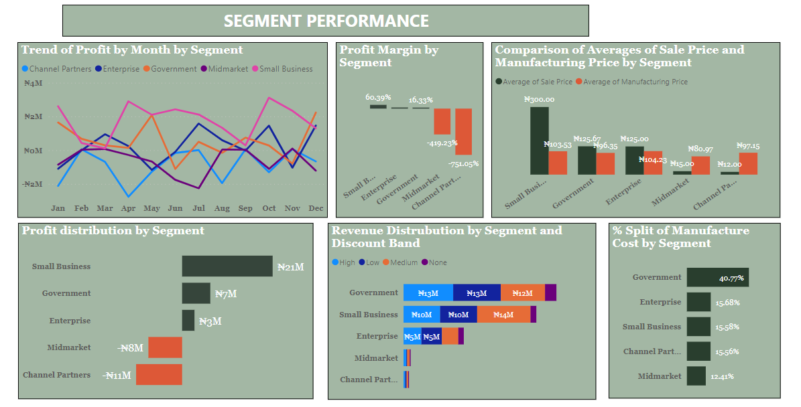

State page
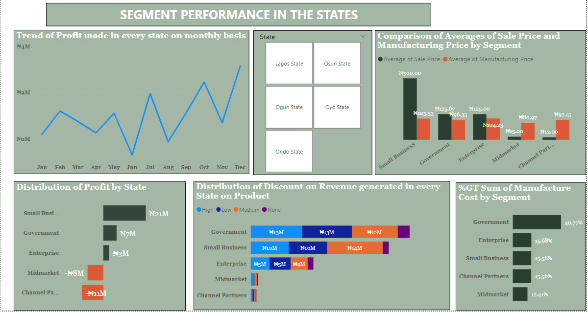

Product page
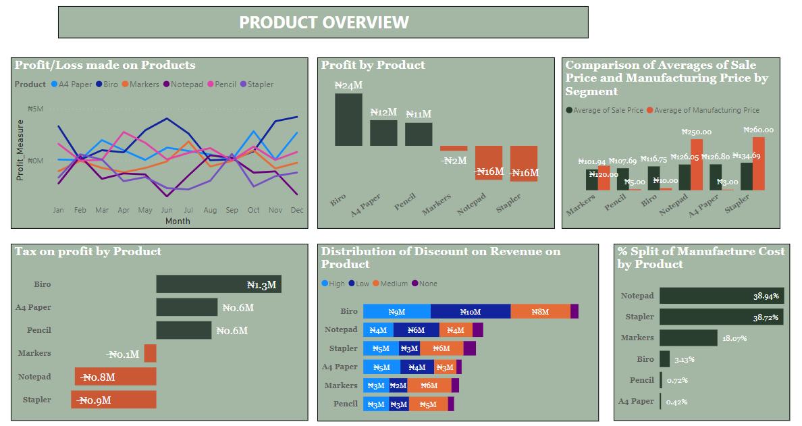

Segment_product page
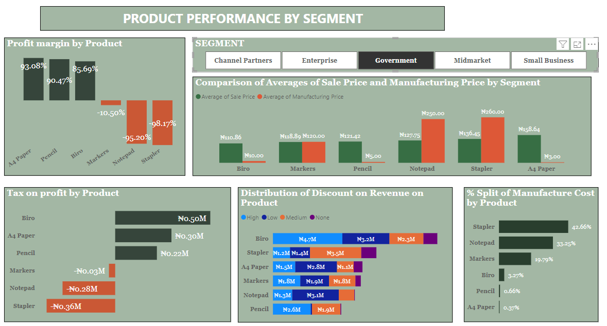

# Analysis

Listed below are some of the Dax formular and calculated columns I wrote.

Gross Sales = [Units Sold]*[Sale Price]

Discount rate = if([Discount Band]="None",0,if([Discount Band]="Low",0.01,if([Discount Band]="Medium",0.05,0.1)))

Discount = [Discount Rate]*[Gross Sales]

Revenue = [Gross Sales]-[Discount]

Manufacture Cost = [Units Sold]*[Manufacturing Price]

Profit before Tax = [Revenue] - [Manufacture Cost]

Tax on profit = 0.05*[Profit before Tax]

Profit after tax = [Profit before Tax]-[Tax on profit]

Month_number = MONTH(financials3[Date])

Year = YEAR(financials3[Date])

Month = FORMAT(financials3[Date],"MMM") 

# PowerBI service link

Click [here](https://app.powerbi.com/links/bJ4fJpgGes?ctid=a4531a04-9d2c-48c6-aee4-9c374f98bea5&pbi_source=linkShare&bookmarkGuid=1286b9ea-2a5d-4b64-a9ad-9ec00985090f) for the interactive dash board on  PowerBI service 

# Presentation slide

The link to the presentation slide is [here](https://docs.google.com/presentation/d/1dHWTbo_3-nc2CO2cbpn5k_KkLSrk8rf0aljMtH1hrhQ/edit#slide=id.p)

# Story Telling
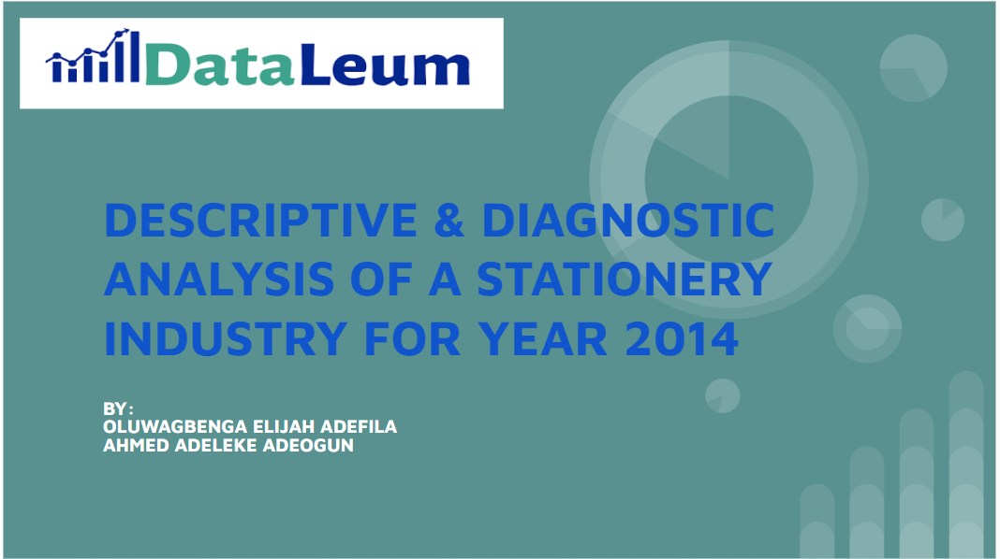
Good day all, Ahmed and I will be presenting to your the report from the analysis Office supply deataset with the title: "DESCRIPTIVE & DIAGNOSTIC ANALYSIS OF A STATIONERY INDUSTRY FOR YEAR 2014".
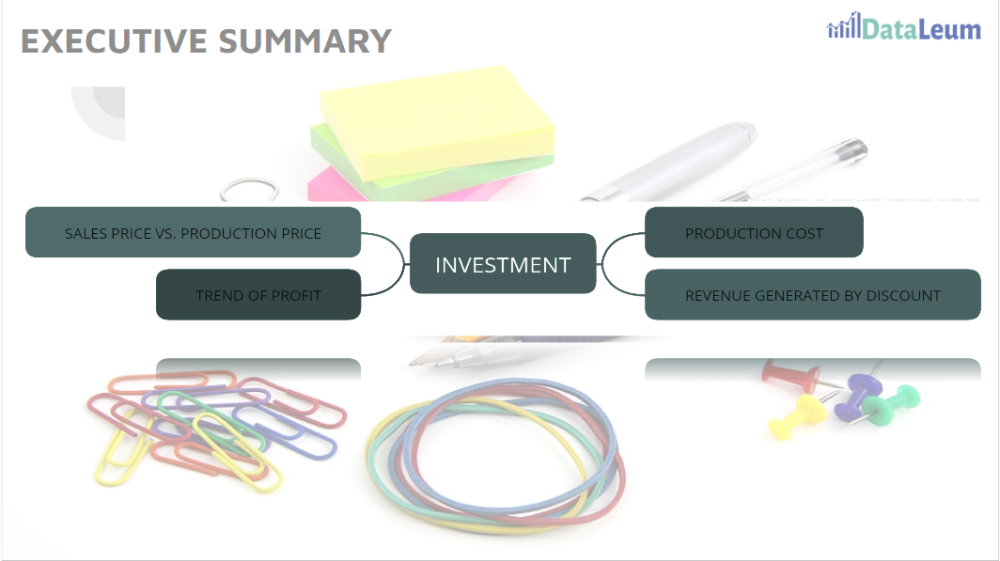
Investors who risk their capital/ready to invest thier capital into the Stationery Industry for the next Fiscal year which dertime sales proportions and financial performance for the present fiscal year by comparing selling Price against production (cost) price, trend of profit, production cost, revenue generated by Discount over the product and across all the segment (segment).
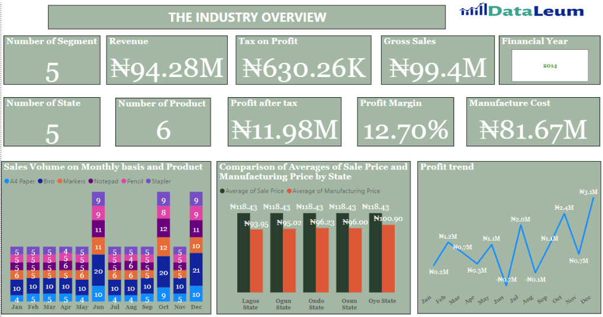
Accross, the stationery industry for the Fiscal year 2014; Sales were very poor, trend of profit is erratic with huge loss June and August and Maximum profit of 3.1M; manufacturing cost eat deeply into the Revenue which then lead the industry to record 12.70% profit margin. These performance were done by 6 segments, across 6 location with 5 products (stapler, notepad, biro, A4 paper and Biro). The average sales price was the same across the state, but manufacrturing cost less in Lagos and cost most in Oyo.
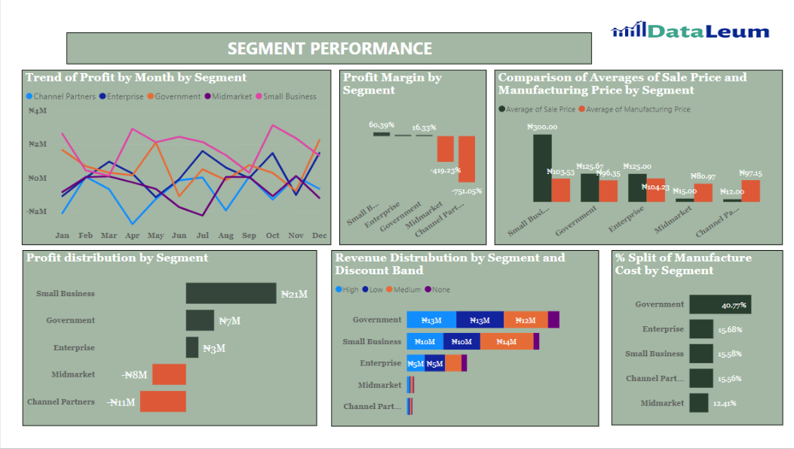
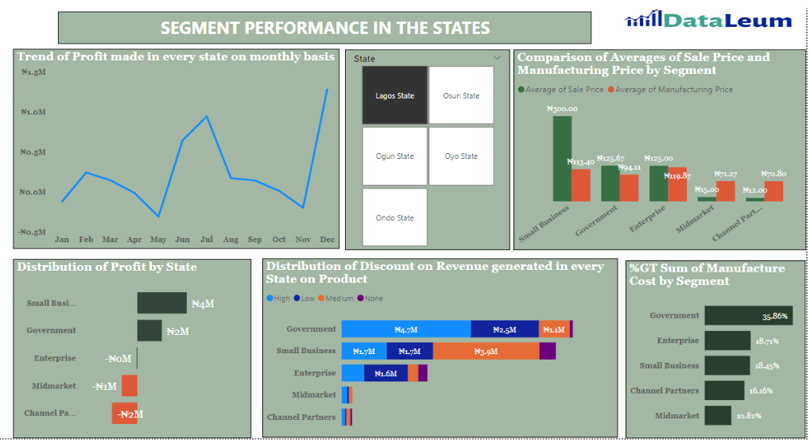
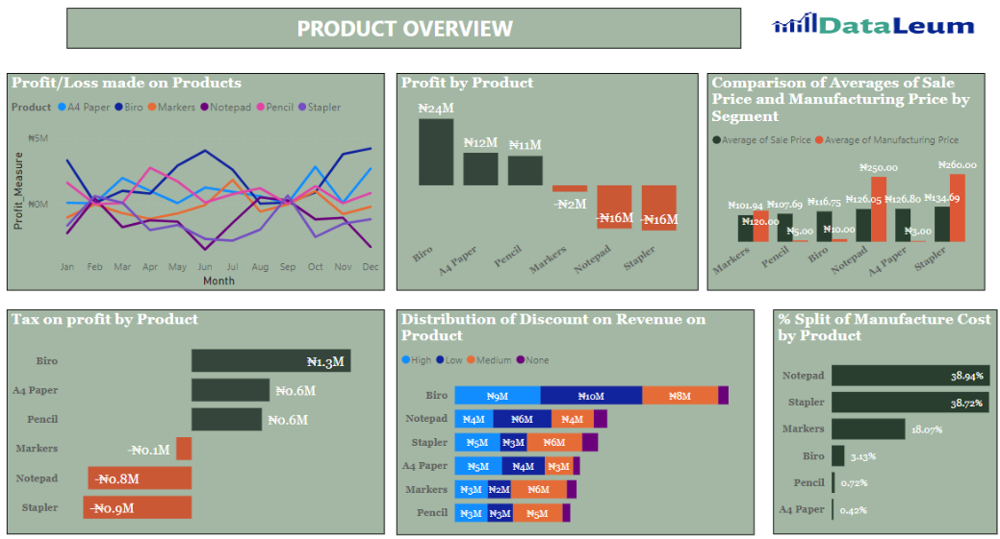
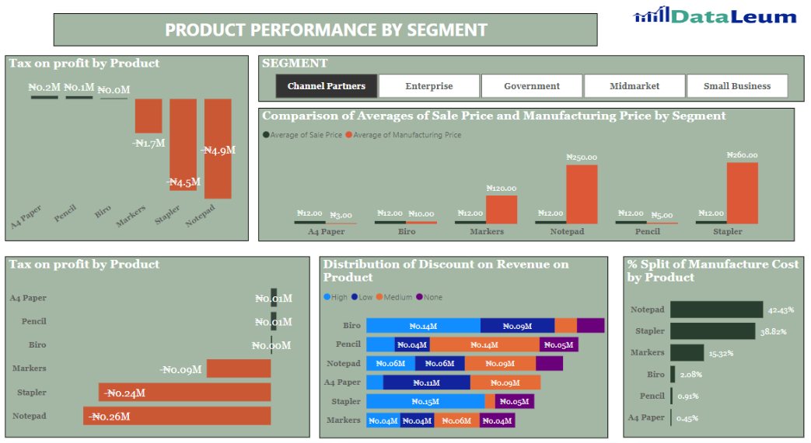

# Key Findings

* Sales is as a result of discount.
* Good/bad  performance of product depend on either sales price is greater than manufacture price of the price and vice versa
* Product such as Staplers, Marker and Notepad should not be manufactured again.

# Recommendation

* Government and Enterprise segment should undertaken measures to minimize Manufacture cost by sources of its raw materials from a cheaper source.
* The Discount Bands: High and Medium should be erased by all segment to mitigate the detriment cost it have on the company’s profit.
* All segment should come up with measure to retain its customer by introducing subscription plan.
* Product such as Staplers and Notepad should not be manufactured again.

# Conclusion
Clearly, every segment can achieve greater profitability if and only if they minimize their manufacture cost and adopt to continue Low discount band.

